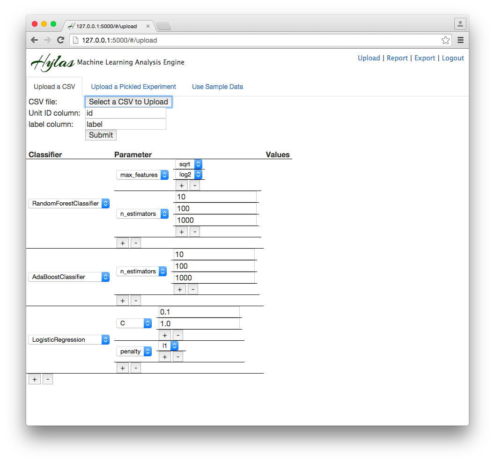
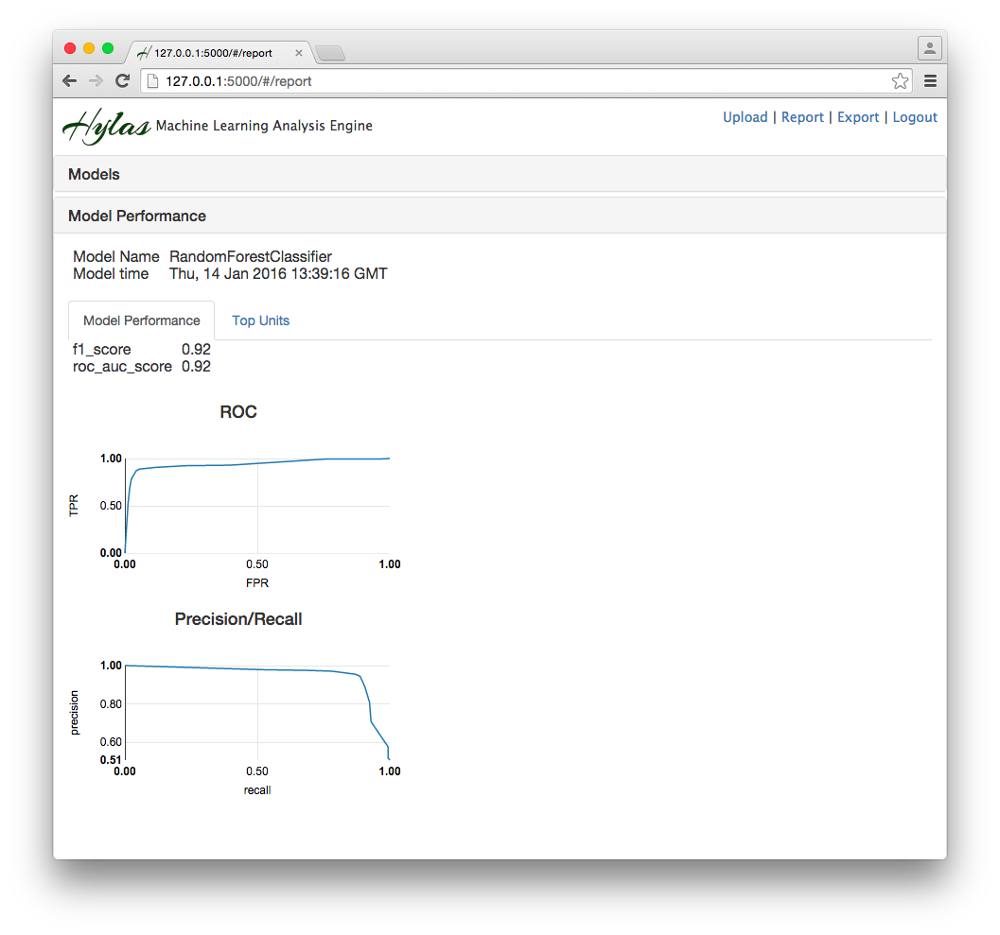
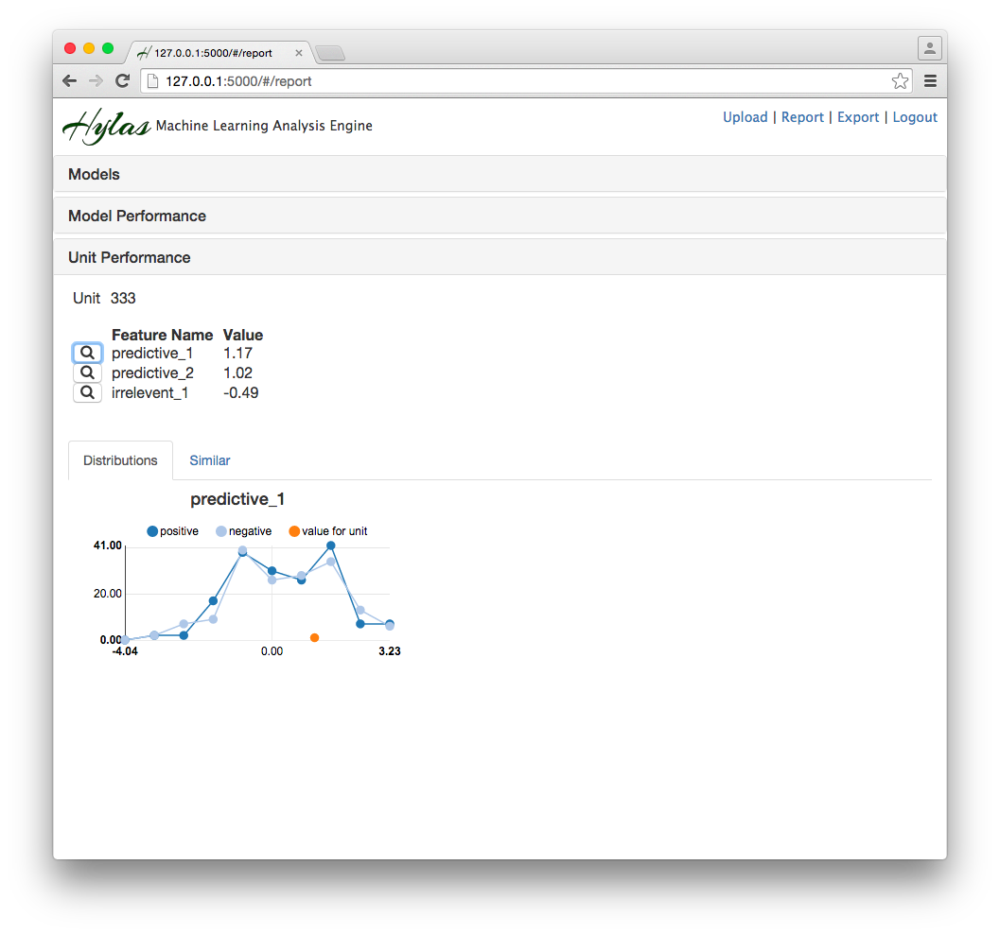
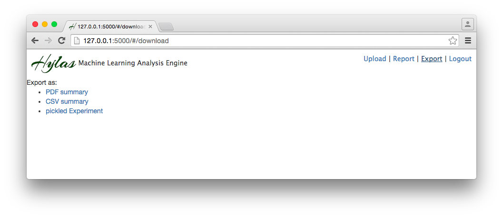

# Hylas

Hylas is a dashboard for performing and visualizing the results of machine
learning experiments. With Hylas, you can: 

1. Rapidly train a number of different classifiers with a number of different 
   parameters on your data.
2. Explore in-depth how each classifier interprets your data and why the 
   classifier interprets it that way.
3. Export your results to a number of portable formats so that you can look
   at things in more detail.

## Usage

### Uploading

The first step in analyzing data is to upload a CSV file that you want 
analyzed. The CSV file should:

1. Have a header that gives the names of each column
2. Have one column that gives a unique, numerical id for each row
3. Have one column that gives a label for each row. (For now, Hylas only
   supports binary classification)

You can specify which columns signify the unit id and the label by filling
out the "Unit ID column" and "label column" text boxes, respectively.

You can also select the classifiers and hyperparameters to use at the bottom
of the page. Use the "+" buttons to add a classifier, parameter, or parameter
value, and the "-" buttons to remove them.

Once you have selected your CSV and your classifiers, you can press the 
"Submit" button.

In addition to uploading a CSV, you can also upload a pickled 
[Diogenes Experiment object](https://github.com/dssg/diogenes) 
(see Exporting below)

### Reporting

After you have uploaded some data, you can move on to the "Report" page. 
This should happen automatically. You can also click on "Report" in the upper right.

First, under the "Models" heading, click on the classifier that you are
interested in studying. That will bring you to the "Model Performance" heading.

The "Model Performance" tab will show you general metrics about how well the
classifier made predictions about your data. The "Top Units" tab tells you
which units were most likely to be labeled as positive and what their
most predictive features were. Click on one of these units to get more detail.

On the top of the "Unit Performance" section are the values for the given unit
for the most important features. When you click on a feature, the 
"Distributions" tab shows the distribution of this feature for positive and
negative results in the data set, as well as the value for that feature for
the unit that we selected. The "Similar" tab shows which units are most
similar to the selected unit.

### Exporting

Click on "Export" in the upper right to see different ways to 
export the data. The PDF and CSVs give detailed summaries of how well the
different classifiers performed. They correspond to the PDF and CSV reports
generated by the 
[Diogenes Experiment object](https://github.com/dssg/diogenes). The 
pickled Experiment is the Experiment object itself, which you can either 
unpickle and examine yourself (requires Diogenes) or you can Upload into Hylas
in case you would like to look at the analysis again.

## Requirements

* [Python 2.7.x](https://www.python.org/)
* [Flask](http://flask.pocoo.org/)
* [Flask-SQLAlchemy](http://flask-sqlalchemy.pocoo.org/2.1/)
* [Flask-Security](https://pythonhosted.org/Flask-Security/)
* [DSSG Diogenes](https://github.com/dssg/diogenes)
* [Bower](http://bower.io/)
* [wkhtmltopdf](http://wkhtmltopdf.org/)

## Running

1. Install required dependencies.
2. From the project's root directory, run `bower install`.
3. If you are running on a headless server, you will have to 
   [configure wkhtmltopdf to run without X](https://github.com/JazzCore/python-pdfkit/wiki/Using-wkhtmltopdf-without-X-server)
3. Create a `config.py` file in the project's root directory. You may use the 
   included `config.py.sample` as a template.
4. Run `python server.py` to start the server
5. Visit `http://127.0.0.1:5000/` with a web browser. This creates the user
   database.
6. Terminate the server.
7. Run `python add_user.py USERNAME PASSWORD` to add a user to the database.
8. Start the server again with `python server.py`. 
9. Visit `http://127.0.0.1:5000/` and log in with the username and password you    have just created.
